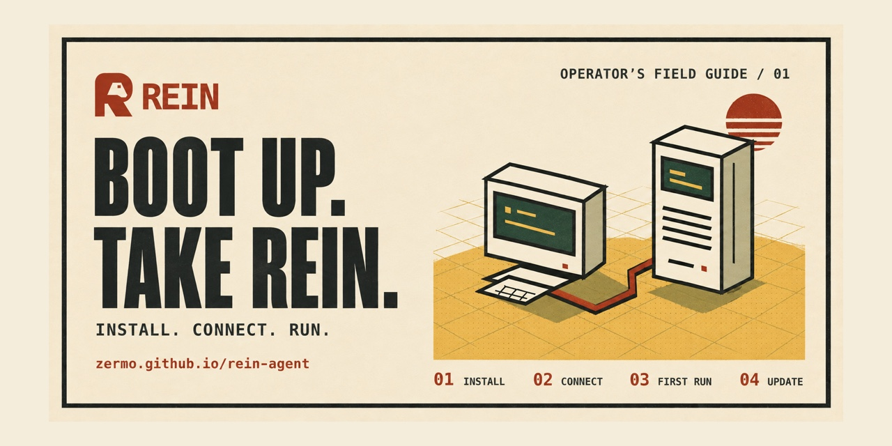

# rein

[](https://zermo.github.io/rein-agent/)

A minimal, local-first agent harness. Three layers, zero runtime dependencies,
any OpenAI-compatible model — local by default, any provider by choice.

```
┌─────────────────────────────────────────────────────────────────┐
│  harness/   REPL · canvas · print · loop · native tools        │  ← the product
├─────────────────────────────────────────────────────────────────┤
│  agent/     event-driven loop · steering · sessions (JSONL)     │  ← the behavior
├─────────────────────────────────────────────────────────────────┤
│  ai/        one message model · one event protocol · compat    │  ← the translation
│             Ollama · LM Studio · llama.cpp · vLLM · any API    │
└─────────────────────────────────────────────────────────────────┘
```

Built by studying two codebases:

- **[pi](https://github.com/earendil-works/pi)** — the architecture. Its
  `packages/ai` proves that the hard part of an agent harness is the
  *translation layer* (one message model + one streaming event protocol over
  every provider quirk), and its `packages/agent` proves the loop is just:
  stream → run tools (parallel) → repeat, with steering queues, hooks, and
  truncation safety. Rein implements these interfaces with zero runtime npm
  dependencies. Pinned native components ship under `vendor/`; esbuild bundles
  the CLI to plain JS because Node won't type-strip `.ts` under `node_modules`.
- **[karpathy/autoresearch](https://github.com/karpathy/autoresearch)** — the
  *loop* that runs an agent forever against one metric, keeping what improves
  and discarding what doesn't. rein encodes that twice: `rein loop` (any
  project, any metric) and `rein improve` (the harness itself is the target).

And **[karpathy/nanoGPT](https://github.com/karpathy/nanoGPT)** — the values:
readable over clever, with explicit limits on context and tool output.

## Requirements

- Node ≥ 18 for the installed CLI (ships prebuilt; zero runtime deps)
- Node ≥ 23.6 (or ≥ 22.18) to develop from source or run the test suite
  (native TypeScript type-stripping)
- Any OpenAI-compatible server. Local ones are probed automatically in
  priority order: **Ollama** → **LM Studio** → **llama.cpp** → **vLLM**.
- tmux and bash for persistent shells and `--visual` on macOS/Linux/WSL.
  Ordinary chat and foreground bash work without tmux. Meat ships prebuilt WASM;
  users do not need Go. Native Windows tmux is not supported.

## Install

For a visual walkthrough with copyable commands, open the
[retro installation field guide](https://zermo.github.io/rein-agent/). It covers
NodeTerm, your own model server over SSH, local models, and supported cloud connections. The
[public wiki](https://github.com/Zermo/rein-agent/wiki) has setup and deployment
instructions. For offline use, open `docs/install.html` from a local checkout.

[](https://zermo.github.io/rein-agent/)

[Repo cards and logo files](docs/branding.md) · [Publish the guide](docs/guide-deployment.md)

Install on macOS, Linux, or WSL and start the guided setup:

```sh
curl -fsSL https://raw.githubusercontent.com/Zermo/rein-agent/main/install.sh | bash
```

On a local macOS desktop, the installer also downloads the separate official
NodeTerm app, verifies its checksum and signature, and installs it in
`~/Applications` if it is missing. Existing copies stay in place. Rein becomes
NodeTerm's default agent when the app is closed during registration. If NodeTerm
is already running, its settings stay untouched; close it later and run
`rein desktop install --no-launch` to finish registration.

Bare `rein` in an interactive local macOS shell opens NodeTerm when installed.
Choose a project and add an agent node to start Rein. NodeTerm currently has no
external session-launch API, so this is one manual step; Rein does not silently
drop a supplied prompt, resume ID, model option, or working directory into a
different session. Commands with options continue in their original terminal.

The installer opens the wizard in your terminal even when installed through the
curl pipe. Answer four work-style questions, review your profile and suggested
skill pack, then connect a model. You can change answers before saving, choose
another pack, or skip skills. The last step offers optional proactive suggestions
for a folder you choose and gives you a first task to try.

Flags after `bash -s --`: `--skip-setup` skips onboarding, model checks, and app launch,
`--yes` runs unattended connection setup without inventing a profile,
`--no-launch` leaves the app closed, and
`--terminal-only` skips NodeTerm and saves a terminal preference.
Linux, WSL, remote shells, and CI keep the CLI path. Install NodeTerm separately
from its [official releases](https://nodeterm.dev/releases) on other supported desktops.

```sh
rein --terminal                 # stay in this terminal for this session
rein desktop use terminal       # save that preference for future sessions
rein desktop install            # install/register NodeTerm and prefer it again
rein desktop status
```

The NodeTerm app is downloaded from the verified upstream release, not bundled
inside Rein. See [desktop integration](docs/nodeterm-desktop.md) for supported
platforms, setup details, and the current native-app limits.
The wizard detects local AI servers (Ollama, LM Studio, llama.cpp, vLLM),
accepts remote hosts, and offers cloud API keys or supported subscription logins.
It tests API connections and saves `~/.rein/config.json` (or `$REIN_HOME/config.json`).
Run `rein setup` again for the full walkthrough. Use
`rein setup --connection-only` to change only the model connection,
or `rein setup --status` to check it.

Or install manually:

```sh
npm install --global git+https://github.com/Zermo/rein-agent.git
rein setup
```

The CLI ships prebuilt (`dist/rein.js`, committed), so the install needs no
build step and no devDependencies. To rebuild the bundle after changing
source: `npm install && npm run bundle` (esbuild, dev-only).
The compatibility commands `rein-agent` and `rein` point to the same CLI.

Developing from source: `npm install && npm test` (offline smoke and regression suites).

To update an installed copy on macOS, Linux, or WSL:

```sh
rein update
```

This downloads the latest installer with curl, then runs it with Bash and
`--skip-setup`. It installs the current prebuilt bundle from `main`, preserving
your configuration, credentials, notes, and sessions under `$REIN_HOME`
(default `~/.rein`). It skips onboarding and model connection checks, so your
model server can be offline. Restart running Rein sessions after the update.
Local changes in the installer checkout are preserved; commit or move them
before updating.

For an older Rein build that does not have the command yet, use:

```sh
curl -fsSL https://raw.githubusercontent.com/Zermo/rein-agent/main/install.sh | bash -s -- --skip-setup
```

Native Windows users can rerun the manual npm installation command above.

```sh
# local, with the Ollama app or server already running:
ollama pull qwen2.5-coder:7b
rein-agent

# any provider:
rein-agent --provider deepseek --model deepseek-chat
rein-agent --provider openai --model gpt-4o
REIN_BASE_URL=http://localhost:11434/v1 REIN_MODEL=qwen2.5-coder:7b rein-agent -p "hello"
```

### Tell Rein how you work

The operator-profile wizard asks what you work on, how much detail helps you,
how you want changes handled, and where you prefer to talk to your agent.
Answers use fixed weights to recommend one of four packs. The profile is a
revisable work preference, with no personality ranking or health assessment.

| Pack | Matching preferences | Bundled workflows |
| --- | --- | --- |
| `ship` | Coding, terse, yolo | `github-pr-workflow`, `tdd`, `caveman` |
| `ops` | Ops, terse, plan | `hermes-agent`, `fleet-command-ops`, `execution-discipline` |
| `study` | Research, walkthrough, ask | `grounded-citations`, `plan` |
| `studio` | Creative, normal, ask | `claude-design`, `comfyui` |

`ops` is the fallback when no rule matches or scoring is tied. You can select
any pack or none. These are bundled workflow instructions; selecting a pack
does not install Hermes, Claude, or ComfyUI. Choosing chat or voice records a
preference; NodeTerm and the terminal remain the available chat interfaces.

Setup saves `SOUL.md` for agent voice, `USER.md` for your work preferences,
`AGENTS.md` for the operating brief, and `profile.yaml` for the machine-readable
`operator_profile` and enabled pack. They live in your private `~/.rein`, or
`$REIN_HOME`, and leave project instructions and model credentials in place.
The profile informs Rein's instructions in future sessions.

```sh
rein profile                   # view your saved profile and enabled pack
rein profile --json            # inspect the structured profile
rein setup profile             # revise it without connecting to a model
rein profile pack study        # choose a different pack
rein profile pack none         # disable profile-pack skills
```

`rein profile setup` also opens the profile wizard. An autonomy preference
changes the operating brief; it does not change `--ask`, host permissions, or
background task approvals. Proactive suggestions are optional. Setup lets you
choose manual scans for a folder, enroll it and start a background service, or
skip proactive work.
Proposed tasks stay pending until you approve them and run within fixed budgets.
See the [operator-profile walkthrough](https://github.com/Zermo/rein-agent/wiki/Operator-profile)
for the questions, saved files, and controls.

## Usage

```
rein-agent                    interactive REPL (sessions persist, steering mid-run)
rein-agent -p "query"         one-shot; --json for the raw event stream
rein-agent loop               autonomous experiment loop (TASK.md + METRIC.md)
rein-agent improve [goal]     self-improvement loop on this repo
rein-agent gates [file] --mode m  unlazy gates: lint | status | approve | reverify
rein-agent models             what rein can see: local servers + provider presets
rein skills [name]            bundled workflows and enabled profile-pack skills
rein debug <folder> [--json]  offline exported-session diagnostics (counts only)
rein update                   download and install the latest published build
rein --visual                 split chat and live activity; press c in the activity pane for the canvas
rein meat --working-tree      review tracked changes with the embedded Meat engine
rein tmux start               start a persistent bash shell
rein-agent hardware [--json]  profile this machine + what it can run (tok/s estimates)
rein doctor [--fix]           auto-detect the whole stack; --fix self-repairs it
rein heartbeat [--init]       self-sustaining beat: self-heal → HEARTBEAT.md tasks → self-advance
rein setup                    guided work profile, model connection, and first task
rein setup --connection-only  change only the model connection
rein setup profile            offline work-style wizard; review and choose a pack
rein profile                  view your profile (also: --json, setup, pack <name>)
rein login codex|copilot       official browser/device account sign-in
rein --version                print version
```

REPL commands: `/help /legend /new /model /tools /sessions /resume <id> /branch /context /new-context [handoff] /skills /skill <name> <task> /stop /quit`.
While the agent is working, just type — it's injected as a steering message
after the current tool batch (pi's steering, not pi's queue).
`/stop` immediately cancels the current turn and its owned shell process group.
Queued input is discarded; send a new request when ready to continue.

### Explicit Chat Completions connections

```sh
rein setup --connection-only --api chat-completions --base-url http://model-host:1234
# When the remote API listens only on its own loopback interface:
rein setup --connection-only --api chat-completions --ssh model-host --base-url 127.0.0.1:1234
```

The wizard records `"api": "chat-completions"` and shows the final POST endpoint.
`REIN_API=chat-completions` and `--api chat-completions` make the same choice for
an invocation. Existing HTTP configurations default to this protocol. Custom
proxy prefixes stay intact; JSON/SSE replies, text-part arrays, refusals, and
usage replies without `total_tokens` work through the same adapter used by setup.
Official subscription CLIs keep their own transport and login; HTTP protocol
flags are rejected when a CLI provider is selected. `model-host` must be your configured
SSH alias; Rein does not create a public listener on the remote machine.

### Clear operator and agent replies

Interactive chat labels every operator turn and agent reply. Operator prompts
are cyan. The `REIN` label keeps its name and cycles its accent and quarter-circle
marker with each numbered reply. Tools have separate named labels. While you
type steering, the display pauses under an operator prompt; agent execution
continues, and its output resumes under the same reply identity after Enter.
`NO_COLOR` removes ANSI color while preserving the labels and spacing.

`MESSAGE` labels ordinary assistant text. A reply that begins with an explicit
`[RESULT]`, `[OPINION]`, `[CHOICE]`, `[CHANGE]`, or `[EDIT]` heading keeps that
agent-declared purpose in its label. These labels do not measure confidence or
verify the claim. Known tool contracts get READ, WRITE, EDIT, EXEC, or other
action labels; matching call numbers connect each request with its tool result.
COMPLETE, HANDOFF, ERROR, CANCELED, and LIMIT show how a reply ended.

THINKING shows a status without exposing hidden reasoning. When the provider
reports reasoning-token usage, Rein shows that count at the end of the reply.
This adapter does not report reasoning effort, and token count or elapsed time
does not measure thinking strength. Use `/legend` for the full label key.

### Persistent bash and a live node canvas

```sh
rein --visual
rein tmux start 'export PROJECT_MODE=dev'
rein tmux list
rein tmux send <session-id> 'printf "%s\n" "$PROJECT_MODE"'
rein tmux capture <session-id>
rein tmux attach <session-id>
rein tmux interrupt <session-id>
rein tmux stop <session-id>
```

The `bash` tool accepts `mode: "tmux"` and an optional existing `session` ID.
The separate `tmux` tool exposes start/list/capture/send/interrupt/stop. Environment,
working directory and interactive programs persist across turns. Rein uses its
own server and scopes sessions by workspace. `/stop` cancels foreground work;
intentionally persistent tmux sessions remain until explicitly stopped.

Inside a local NodeTerm session, interactive Rein records and opens its activity
view automatically. Eligible nodes embed it on the native canvas. Baseless custom
agent nodes lack that capability, so the detailed view opens in a browser while
chat stays in NodeTerm. Use `--no-browser` or `--visual=false` to skip automatic
activity opening. Remote sessions do not auto-open a remote loopback URL.

`--visual` opens chat beside a terminal activity tree. Press **Ctrl-b Right** to
focus the activity pane, then **c** to open the interactive node canvas. Select
nodes for inputs, results and file paths; drag nodes or the background, zoom,
fit, or follow the latest work. Arrow keys select terminal steps, **f** follows,
and **q** closes the activity pane. Thinking appears as a status; only visible
assistant text and actual tool activity are recorded.

Detach with **Ctrl-b d**. The launcher prints an activity ID and a resume command;
use `rein tmux list --view`, `rein tmux attach <id> --view`, or
`rein tmux stop <id> --view` to manage visual sessions. Their server is separate
from the model's tool shells. Closing a view does not implicitly stop persistent
tool shells. `rein watch <activity-id>` reopens its activity tree;
`rein canvas <activity-id>` opens just the browser view (`--no-browser` prints
the URL). Ctrl-C stops a standalone canvas server.

Activity snapshots live in `$REIN_HOME/activity`, mode 0600, and retain up to 256
recent steps within 3 MB. Long details are abbreviated. They contain local tool
inputs/results, so treat them like session files. The canvas listens only on
127.0.0.1 and requires its printed capability URL. No transcript is uploaded.
The activity log is separate from Posthorse and is never added to model context.

### Embedded Meat diff review

```sh
rein meat                     # latest commit
rein meat main HEAD           # commit range
rein meat --staged            # staged changes
rein meat --working-tree      # tracked changes against HEAD
rein meat --working-tree --json
```

Single-commit review compares merges to their first parent; root commits are
reviewed against an empty tree. Commit ranges compare their two endpoints.

Rein embeds [Bold Software's Meat](https://github.com/boldsoftware/meat) at a
pinned revision. Its actual Go algorithm runs as WASM in an isolated Node worker;
Rein supplies the configured HTTP or official CLI model connection and scoped
source reads. The agent's `meat` tool uses that session's model overrides and
streams review progress into the activity view.

Meat validates the model's remove/replace/fold plan against the original diff and
produces a reading diff and summary. It does not modify files. Limits are 4 MB
of input, 32 model requests, and five minutes per review; Ctrl-C or `/stop`
cancels the request. Source reads exclude hidden/private paths, links and files
over 200 KB. The host's grep tool advertises bounded literal search, not regex.
Untracked files are outside `--working-tree`. Model usage is additional to the
main conversation and is reported with the result; a review is not a guarantee
that a change is correct. See [the pinned runtime and build details](vendor/meat/UPSTREAM.md).

### Native Fold components and Matt Pocock workflows

Rein integrates [Fold](https://github.com/humanlayer/fold)'s repeated-tool-batch
detector and UTF-8 output truncation, with a native skill loader based on its
stable roster design. This is a component integration, not the full Fold CLI.
Three identical consecutive tool batches stop the run with an incomplete-work
notice. Set `repeatToolLimit` to 0 to disable, or an integer from 2 to 50 to tune it.
Shell output keeps up to 500 lines / 20 KB, including single-line output.

[Matt Pocock's skills](https://github.com/mattpocock/skills) ship as native
workflows: `diagnosing-bugs`, `tdd`, and `code-review`. The model loads them
through `skill`; users can invoke `/skill diagnosing-bugs <task>` in the REPL.
`rein skills tdd tests.md` reads a bundled reference without starting inference.
Bodies load on demand without changing the system prefix. Scripts stay inert
unless separately executed within the user's request. Skills do not themselves
provide sub-agent tools.

`rein debug /path/to/export` reads JSONL sessions offline. It reports counts of
empty responses, provider errors, nested recovery, path mistakes, large outputs,
and repeated tool batches. `--json` includes counters per session in sorted
file order; output never includes transcript text, filenames, or credentials.
The analyzer reads at most 200 files, 32 MB per file, 256 MB total, and skips
records above 8 MB. See the [September export diagnosis](docs/debug-2026-09-05.md)
for findings, fixes, and limitations. Both upstreams are pinned under `vendor/`;
`npm run check:natives` verifies their source and license hashes.

### Host models on your own hardware

Rein connects to an OpenAI-compatible Chat Completions server on this computer,
on another machine in your LAN, or through a mesh VPN such as NetBird or Tailscale.
Choose a model that fits the serving machine's memory and supports tool use for
coding tasks. The server handles inference; Rein runs in your project directory.

| Server | Start serving | Default local API base |
| --- | --- | --- |
| [LM Studio](https://lmstudio.ai/docs/developer/core/server) | Install the app, download and load a model, then start the server in the Developer tab | `http://localhost:1234/v1` |
| [Ollama](https://docs.ollama.com/quickstart) | Install Ollama, start the app or `ollama serve`, then download a model with `ollama pull MODEL_ID` | `http://localhost:11434/v1` |
| llama.cpp | Start its OpenAI-compatible `llama-server` with your model | `http://localhost:8080/v1` |
| vLLM | Start its OpenAI-compatible server with your model | `http://localhost:8000/v1` |

Use the actual URL shown by your server if its port or API prefix differs.
`MODEL_ID` is a placeholder for a model you choose from the server's catalog.

```sh
rein setup
# Or choose a known local server explicitly:
rein setup --provider lmstudio --api chat-completions
rein setup --provider ollama --api chat-completions
```

Interactive setup checks localhost, saved endpoints, and known private LAN/mesh
peers from the neighbor table, NetBird, and Tailscale. It probes the four common
ports above plus ports from saved or explicit hints. The scan is bounded to 16
peers, 80 endpoint candidates, 8 concurrent checks, and 10 seconds. It does not
sweep subnets. Server labels come from API evidence, not a port number.

The menu keeps reachable servers that need authentication or have no loaded
models. Choose one to enter a key or load a model. Rein normalizes API paths,
accepts pasted `/models` or `/chat/completions` URLs, and tests a chat response
before saving. Credentials are scoped to an explicitly configured endpoint and
SSH host; peer probes do not inherit them.

```sh
rein models --discover-network
rein models --discover-network --json
# Add an unusual listening port or a host absent from the peer table:
rein models --discover-hosts model-host --discover-ports 9000
# Keep interactive setup limited to localhost and configured endpoints:
rein setup --connection-only --discover-network=false
```

`rein models` and unattended setup stay local/configured by default. Add
`--discover-network` to opt into known peers. Loopback-only remote APIs still
need an explicit SSH route. Discovery cannot make an unreachable listener
reachable. See the [discovery guide](https://github.com/Zermo/rein-agent/wiki/Server-discovery).

### Connect through a LAN, mesh VPN, or SSH

For direct access, the model server must listen on an interface reachable from
the computer running Rein. In LM Studio enable **Serve on Local Network**, or run
`lms server start --port 1234 --bind 0.0.0.0`. Enable the server's authentication
when sharing it. See [LM Studio network setup](https://lmstudio.ai/docs/developer/core/server/serve-on-network).
For Ollama, configure `OLLAMA_HOST` and restart its app or service as described in
the [Ollama network configuration](https://docs.ollama.com/faq#how-can-i-expose-ollama-on-my-network).
Restrict access with your firewall or mesh access rules.

Replace `model-host` below with your server's LAN or mesh hostname or IP, and use
its listening port. Both devices need the appropriate network route and access.
`0.0.0.0` is a listener setting, not the address to enter in Rein.

```sh
rein setup --api chat-completions --base-url http://model-host:1234
# Unattended setup chooses a discovered model; set REIN_API_KEY if required:
rein setup --yes --api chat-completions --base-url http://model-host:1234
```

A loopback-only API is reachable from its own machine. Use your existing SSH
alias to reach it without changing the server listener:

```sh
ssh model-host                    # verify your SSH configuration and host key
ssh -o BatchMode=yes model-host true
rein setup --ssh model-host --base-url 127.0.0.1:1234 --api chat-completions
rein -p "hello"                   # reconnects through SSH automatically
rein setup --status
```

With `--ssh`, the target URL is interpreted from the remote machine. Without it,
`127.0.0.1` means the computer running Rein. The tunnel uses an ephemeral local
loopback port and closes after each request. SSH forwarding supports HTTP APIs
and requires noninteractive SSH authentication. Direct HTTPS APIs use their
reachable URL.

The [self-hosted model walkthrough](https://github.com/Zermo/rein-agent/wiki/Self-hosted-models)
covers installation, remote access, connection checks, and troubleshooting.

### API keys and subscription login

For cloud APIs, setup opens the provider's key page when a key is needed, then
queries the authenticated model list. Standard environment variables such as
`OPENAI_API_KEY` or `GEMINI_API_KEY` work; `REIN_API_KEY` explicitly supplies a key
for a custom endpoint. Environment keys are not saved. Entered keys are hidden,
stored in a mode-600 config, and scoped to the saved API endpoint and SSH host.
Switching endpoints cannot reuse that saved key automatically.

```sh
rein setup --provider openai
rein setup --provider gemini
rein setup --provider xai       # XAI_API_KEY or the hidden key prompt
rein setup --provider openrouter --no-browser  # print the key-page link
```

Subscription connections use installed official CLIs:

| Connection | Install once | Configure Rein |
| --- | --- | --- |
| ChatGPT through Codex | `npm install -g @openai/codex` | `rein setup --provider codex` |
| GitHub Copilot | `npm install -g @github/copilot` | `rein setup --provider copilot` |
| SuperGrok / X Premium+ | `npm install -g @xai-official/grok` | `rein setup --provider grok` |

Setup opens device sign-in and lets the official CLI display the one-time code.
`rein login codex`, `rein login copilot`, or `rein login grok` repeats login; `--device-auth=false`
selects the CLI's browser callback flow. `--no-browser` prints the link without
launching a browser. Login requires user interaction; `setup --yes` never starts it.
ChatGPT device login may need enabling in your account or workspace security
settings. Access and billing follow the selected provider and account. See the official
[Codex authentication guide](https://learn.chatgpt.com/docs/auth) and
[Copilot authentication guide](https://docs.github.com/en/copilot/how-tos/copilot-cli/set-up-copilot-cli/authenticate-copilot-cli).

Rein gives each CLI its own configuration under `$REIN_HOME/cli-auth` and leaves
credential storage and refresh to that CLI. Copilot may use its shared OS keychain.
Use `rein login`, rather than a bare CLI login, to select Rein's configuration.
The default model follows the official CLI; pass `--model` for an available model.
CLI responses use Rein's text tool protocol and retain Rein's tool approvals and
Posthorse history. Each turn starts in a temporary directory with native tools
disabled or sandboxed; unexpected native Codex or Grok tool events stop the turn.
CLI output is returned when that CLI turn finishes, rather than token by token.
These bridges require current CLIs with the isolation flags used by Rein.

Gemini API uses its documented [OpenAI-compatible endpoint](https://ai.google.dev/gemini-api/docs/openai).
The retired GitHub Models API is no longer offered; [GitHub's retirement notice](https://docs.github.com/en/github-models)
applies to that API, while Copilot CLI is a separate connection.

Grok subscriptions use the official Grok Build CLI and its device login. Basic X
Premium is not advertised as eligible; the supported X tier is **Premium+**.
For direct HTTP instead, `--provider xai` uses `https://api.x.ai/v1` and
`XAI_API_KEY`. Setup prefers xAI's language-model catalog so image/video models
are not suggested for agent chat. Check your account's current allowances in
the official [Grok Build announcement](https://x.ai/news/grok-build-cli) and
[CLI reference](https://docs.x.ai/build/cli/reference), or follow Rein's
[Grok guide](https://github.com/Zermo/rein-agent/wiki/Grok).

### Tool calls work for every model

The compatibility layer (`src/ai/compat.ts`) guarantees tool capability
regardless of what the model natively supports:

1. **Capability table** — model-name patterns: known-good (qwen2.5/3,
   llama3.1+, deepseek, gpt-*) use native function calling; known-weak
   (tinyllama, qwen ≤1.8b, gemma ≤2b, phi-2) start in **text protocol**.
2. **Runtime fallback** — if a native toolUse turn comes back with empty or
   unnamed arguments, rein flips that model to the text protocol
   (`<tool name="bash">{"command": "ls"}</tool>`) mid-session and tells the
   model.
3. **Learned modes** — decisions persist in `~/.rein/capabilities.json`, so
   the next session starts in the mode that already works.

Plus JSON salvage (`src/util/json-salvage.ts`): malformed tool arguments from
small models (trailing commas, raw newlines, invalid escapes, prose around
the JSON) are repaired, never fatal.

Override with `--tools native|text|auto` (auto is the default).

### Fresh context with Posthorse

Rein includes a native adaptation of [pi-posthorse](https://github.com/fitchmultz/pi-posthorse).
The pinned upstream 0.4.1 source and MIT license are in `vendor/pi-posthorse`.
Rein uses its own session and tool interfaces, so it needs neither the Pi fork
nor additional runtime dependencies.

The default toolset includes:

- `get_context_remaining({})` reports estimated tokens until rollover and the hard limit.
- `new_context({handoff?})` requests a fresh window after the entire tool batch succeeds.
  A failed or cancelled sibling prevents the boundary from committing.
- `notes({op, path?, content?, query?, offset?})` lists, reads, writes, appends,
  or searches plaintext files in `.pi/notes`. Reads and searches are paged.
- `history({op, query?, id?, all?, limit?, offset?})` searches and reads saved
  messages across windows. Results include stable entry and window ids.
  `all: true` includes sessions from the same repository and deduplicates forks.

A rollover removes earlier messages from model input while keeping the complete
transcript. The new window gets an optional handoff. Automatic rollover uses a
bounded record of user inputs, an older checkpoint, and the latest unconsumed
tool batch, with history references for the full text. It makes no summarization
request. The record is not proof of progress; the agent must restore notes and
check live state before continuing. A single input that cannot fit a fresh window
still needs a larger context setting or a smaller input.

Automatic rollover and one best-effort checkpoint reminder are enabled with the
default tools. Context overflow errors get at most one recovery retry for the same
request, within `--max-turns`. Configuration in `~/.rein/config.json`:

```json
{
  "contextWindow": 32768,
  "maxTokens": 4096,
  "posthorse": { "enabled": true, "reserveTokens": 4096 }
}
```

Set `contextWindow` to the server's actual configured limit. Token counts are
estimates refined by reported usage. The reserve must cover the output limit and
leave room for the prompt, tools, and recovery state. CLI overrides are
`--context-window <tokens>`, `--reserve-tokens <tokens>`, and `--no-auto-context`.
Manual `/new-context [handoff]` and the `new_context` tool remain available when
automatic rollover is disabled. `/context` prints the current budget.

Sessions persist incrementally in the REPL and with `-p --save`. Reopening a
non-empty session creates a fresh resume window: it retains the full archived
transcript in `history`, then layers the current Git checkpoint, a squashed diff
since that session's checkpoint, the newest peer-session handoff, and
`.pi/notes/MEMORY.md` over the next model request. This makes a week-old branch
safe to continue after another session changed the repository without replaying
all of its old tool calls. The overlay is factual workspace evidence, not a
generated summary; verify live state before an external action. Branch preserves
window boundaries, and old Rein JSONL sessions remain readable. Print,
loop, and improve runs without a saved session retain history only for the lifetime
of their runner. Supplying a custom `RunnerOptions.tools` array replaces the
entire toolset and disables automatic rollover by default; `--no-tools` remains
pure chat.

Notes belong to the repository and are shared by linked worktrees. Normal
worktrees use the main checkout. Repositories with a separate Git directory use
`core.worktree` when configured, or the common Git directory otherwise. Outside
Git, notes belong to the working directory. Rein ignores `.pi/notes/` in this repo;
add that ignore rule to other projects if their working notes should stay local.
Notes survive session changes and package removal. History reads send the selected
stored text to the active model provider. Pi's JSONL sessions and image/custom
message types are not supported by this adaptation.

For llama.cpp and compatible local HTTP servers, Rein sends `cache_prompt: true`.
llama.cpp can reuse an unchanged live prompt prefix; `/context` shows
`lastPromptCacheTokens` when the server reports it. Provider KV cache is
opportunistic: a stopped server, evicted slot, or a week-old archived request
cannot restore its transformer state. The durable resume overlay provides the
cross-session continuity in that case.

### Web search and scraping with Obscura

`web_search` reads DuckDuckGo's first HTML results page through the local
[Obscura browser](https://github.com/h4ckf0r0day/obscura). It returns source URLs,
titles, and snippets. `web_fetch` renders one page, executes its JavaScript, and
returns the title, final URL, and markdown. Neither tool needs an API key.

```sh
rein web install
rein web status
rein web search 'site:github.com obscura browser' --max-results 5
rein web fetch https://example.com --max-chars 20000
```

First web use installs the pinned Obscura 0.2.2 no-render build automatically.
The download is about 39–48 MiB, verified against its release SHA-256 before
extraction. It lives under `$REIN_HOME/native/obscura`, default `~/.rein/native/obscura`.
macOS/Linux arm64 and x64 and Windows x64 have pinned builds. Go, Rust, Chromium,
and runtime npm packages are unnecessary. Ordinary chat works without Obscura.

An absolute `OBSCURA_BIN` or `obscura.bin` overrides the managed runtime.
Otherwise Rein prefers its installed runtime, then an `obscura` executable on
PATH. Optional configuration in `$REIN_HOME/config.json`:

```json
{"obscura": {"bin": "/absolute/path/to/obscura", "timeoutSeconds": 30, "allowPrivateNetwork": false}}
```

Each request uses temporary browser storage, with a bounded process lifetime
and output. `/stop` cancels and drains the browser process. Set
`OBSCURA_ALLOW_PRIVATE_NETWORK=1` or `obscura.allowPrivateNetwork=true` when you
want pages on local or private networks. The default retains Obscura's network
restriction. This setting applies to page subresources too.

Search supports `query`, `max_results`, `include_domains`, and `exclude_domains`.
Domain filters check the returned hostnames, including subdomains, and only
filter the first page. Blocked/CAPTCHA pages and unrecognized markup produce
errors. They are not reported as empty searches. Web results are evidence;
the agent is instructed to cite their source URLs.

Existing tool names and `web_fetch.max_chars` remain compatible. TinyFish keys
and its old `tinyfish` config are ignored. Its minute freshness, news/research
verticals, localization, and later-page filters are unsupported and return
explicit errors. Legacy `purpose` text has no ranking or extraction effect.
Obscura's single-page CLI does not expose an HTTP status code, so a rendered
HTTP error page is returned as page content with its title and URL.

### Completion gates (unlazy)

[unlazy](https://github.com/Leonxlnx/unlazy) (MIT, vendored at `vendor/unlazy/`)
is the anti-laziness discipline: write an acceptance ledger **before** the
work, run oracles that can actually fail, reverify before reporting done.

```
rein gates GATES.md --mode lint        # oracles that cannot fail? caught now
rein gates GATES.md --mode status      # report only — never executes
rein gates GATES.md                    # = --mode approve: approve exact oracles, run them
rein gates GATES.md --mode reverify    # re-run everything; demote stale evidence
```

A gate passes only when its command exits 0 **and** `EXPECT:` matches the
output; the ledger records shell, CWD, exit status, and a SHA-256 output
fingerprint as `EVIDENCE:`. Untested claims are not evidence — a checked box
without evidence counts as unmet. Approval is the trust boundary: a `CHECK:`
line is never executed until its exact command+CWD+PATH oracle is approved
(stored in `~/.unlazy/approved`, outside the repo by design).

The agent sees all of this as one tool (`gates`) and a section of the system
prompt: substantial work starts with `GATES.md` from
`vendor/unlazy/templates/gates-leaf.md`. The repo's own `GATES.md` is the
ledger for the current integration work — every box checked with evidence.

### Self-improvement

```sh
rein improve "make tool errors more actionable"   # or: rein improve (uses LESSONS.md)
```

The loop (autoresearch's keep/discard, pointed at rein's own source):

1. read the goal or the `## harness` section of `LESSONS.md`
2. one concrete weakness → smallest fix
3. run `npm test`, including the smoke and regression suites
4. pass → commit the change and lesson · fail → discard the experiment and commit its lesson
5. repeat until `--max-iterations` (default 5) or the agent says no-change

Two things make it a *system* rather than a one-off: the system prompt tells
every agent to append durable learnings to `LESSONS.md` (shared memory across
sessions, loaded on next start), and `rein improve` reads exactly that file.
The agent that bumps into a sharp edge writes it down; the improve loop cuts
the edge.

### Self-sustaining — `rein doctor` + `rein heartbeat`

Expected Node versions in the compatibility matrix are recorded as
`{ kind: "compatibility", silent: true }` flags. They stay out of terminal
warnings, repair prompts, and warning/failure totals. `rein doctor --json`
retains the flags, and heartbeat writes them to `$REIN_HOME/heartbeat.log`
(default `~/.rein/heartbeat.log`). Use `--silent=false` with doctor or heartbeat
to display compatibility information; `--silent` is the default. Actual health
warnings and failures remain visible. This controls Rein diagnostics; GitHub
generates its own Actions runtime annotations.

The baseline for agents that keep themselves alive and advancing. Two commands:

```sh
rein doctor [--fix]    auto-detect: node → bin → repo → bundle → config →
                       server → model → hardware fit → perms → disk
                       --fix repairs what it can (git pull, rebuild bundle,
                       ollama pull, chmod) and re-checks. exit 1 if anything
                       is still broken — scriptable in CI and cron.

rein heartbeat         one beat, four phases, in order:
                       1. SELF-HEAL    rein doctor --fix
                       2. TASKS        each HEARTBEAT.md line → an agent run
                       3. SELF-ADVANCE one `rein improve` iteration (goal from
                                      `# improve: <goal>` in HEARTBEAT.md or --improve)
                       4. MEMORY       JSONL entry → ~/.rein/heartbeat.log
```

`HEARTBEAT.md` (the openclaw/hermes pattern) is a file of periodic tasks —
one per line, `#` lines are comments, empty = idle beat (self-heal only).
Seed one with `rein heartbeat --init`. The beat repairs its own runtime
before doing any work, so a stale checkout or stale bundle heals itself on
the next tick instead of waiting for a human to notice:

```sh
rein heartbeat --init          # write a template, edit it
*/30 * * * * rein heartbeat >> ~/.rein/heartbeat.cron.log 2>&1
```

That ordering is the point: *perception (doctor) → action (tasks) →
egeneration (improve) → memory (log)*. An agent that can check itself,
fix itself, do its periodic work, and improve itself from its own lessons
is the baseline for fully self-sustaining agents.

### Proactive work from task history

`rein autonomy` adds a background supervisor and a terminal dashboard. It uses
the host's user service manager: launchd on macOS, or systemd on Linux. The
onboarding wizard offers folder enrollment and a separate background-service
choice. Installing the package alone does not start inference.

Start in a workspace whose Rein history you want the supervisor to inspect:

```sh
rein autonomy init
rein autonomy scan
rein autonomy tui
```

The first command enrolls the directory and leaves the supervisor paused. The
scan compares older and recent user/assistant excerpts with current Git status
and change statistics. A tool-free adviser proposes work; a second tool-free
reviewer checks it against the evidence. Unchanged history makes no model calls.
Prior approval decisions and completed run reports inform later suggestions.

The dashboard shows the exact task, workspace, cadence, reason, and cited history
excerpts before approval. Use arrows or j/k to select, `a` to review approval,
`d` to dismiss, `r` to queue an enabled task, `p` to pause/resume, and `q` to exit.
New pending proposals produce dashboard alerts. The regular REPL also reports
new proposals between turns; `/autonomy` shows their status.

Start the background service after reviewing its scope:

```sh
rein autonomy enable
rein autonomy status
rein autonomy pause
rein autonomy resume
rein autonomy disable
```

`enable` enrolls the current directory and registers only Rein's own user service.
`disable` pauses work, stops the service, and removes its registration, keeping
reports and decisions. `rein autonomy plan` prints the generated service
definition. Unsupported hosts can use `rein autonomy resume` followed by
`rein autonomy daemon` in a terminal. User services depend on the login session;
Linux persistence after logout requires a host already configured for it. The
supervisor does not prevent system sleep or attach to other applications.

The service uses saved Rein configuration and official CLI login profiles.
Terminal exports such as `REIN_BASE_URL`, `REIN_MODEL`, or API keys may be absent
from its environment. `enable` checks for those differences and stays paused
until startup is confirmed. Save the intended settings with `rein setup`, or use
`rein autonomy daemon` from the configured shell. API keys are never copied into
service definitions. To save an API key through interactive setup, unset its
shell variable for that command, then enter the key and choose to save it.
For an SSH tunnel to a model server, the service also needs noninteractive SSH access;
an agent available only through the terminal's `SSH_AUTH_SOCK` may be unavailable.

Dashboard approvals enable read-only inspection with bounded `read`, `ls`, and
literal `search` tools. These tools exclude links, hidden files, and common
credential files. For a task that needs editing or command execution, review
`rein autonomy show <id>` and explicitly run:

```sh
rein autonomy approve <id> --allow-writes
```

This grants the normal Rein tools, including shell commands and file writes,
for that proposal. Those tools run with your account's permissions; the working
directory is not an OS sandbox. Revocation and pause cancel active background
work, and each tool call checks that its approval still applies.

Routine proposals recur at their approved interval. Loop and project proposals
receive one bounded run; continuing a larger project needs another explicit
run. Runs save a normal Rein session and a report. Generated sessions and their
forks cannot become fresh evidence of user intent.

Defaults are one history check per hour, six operations per rolling 24 hours,
eight model turns per approved run, and a 180-second cancellation deadline.
A scan uses at most two model generations and counts as one operation. Limits
can be set with `init --interval 60 --daily-budget 6 --turn-budget 8 --timeout 180`.
Scans and runs share a lock and budget; model failures are recorded and scans
wait until their next interval before retrying.

Enrollment is explicit and limited to 32 directories. Use
`rein autonomy init --workspace /absolute/path` for additional workspaces. The
command `rein autonomy unenroll --workspace /absolute/path` removes a workspace
and disables its tasks. The
collector reads only Rein JSONL histories matching those directories, at most
200 sessions with bounded older/recent excerpts. It omits tool bodies, thinking,
and recognizable credentials. Chat histories from other apps are not imported.
The selected evidence and inspected file text are sent to your configured model.
Learning here consists of persisted reports and review decisions, stored in
`$REIN_HOME/autonomy/state.json`. State retains at most 100 proposals and 200 run
reports; full run sessions remain in the normal Rein session archive.

### Autonomous experiment loop

```
your-project/
├── TASK.md      what to improve (agent-readable)
└── METRIC.md    fenced bash block; its output must print METRIC=<number>
rein loop --max-iterations 10
```

Run from a clean Git repository root with an initial commit, including `TASK.md`
and `METRIC.md`. The harness owns commits and discards; if the agent changes
HEAD, the loop stops for review.

Fixed budget per iteration, one metric, keep/discard with git, auto-stops
after three no-change iterations, never otherwise stops until the budget or a
Ctrl-C. This is autoresearch's `program.md` loop with the harness as the
operator.

### Local model fit — `rein hardware`

Stolen concept from [Magnitude](https://github.com/magnitudedev/magnitude)
(Apache-2.0): profile the machine, then tell you what you can actually run —
with a per-domain memory model (system RAM vs VRAM, unified memory handled as
one pool) and reserves before a model may claim memory (`max(pool/10, 2 GiB)`).

```sh
rein hardware             # this machine, ranked models, prerequisites and recipes
rein hardware --json      # the same evidence for another tool
```

Recommendations consider the operator's work focus, memory headroom, context
length, quantization, and accelerator placement. They do not call the smallest
model with the highest estimated speed the best agent. The report shows engine
prerequisites and serving/check commands for LM Studio, Ollama, llama.cpp, and
vLLM where the model and hardware have a supported recipe. It never downloads
a model or starts a service by itself.

Fit and throughput are estimates, not measurements. GPU memory is assessed per
device; unsupported split/offload behavior is not assumed. Unknown hardware or
model architecture stays marked as unknown. The report explains its assumptions.

The installer shows a local fit summary and a **Help me host a model** option.
Run `rein hardware` on the actual model host when using a remote server: the
machine running Rein or its gateway cannot reveal a remote GPU's capacity.
See [Hardware and serving](https://github.com/Zermo/rein-agent/wiki/Hardware-and-serving).

## Architecture notes (what I took from pi, and where I cut)

**Kept — it's load-bearing:**

- The `ai` layer as a *translation* layer: one message model
  (user / assistant[content blocks] / toolResult), one streaming event
  protocol (`start → *_start → *_delta → *_end → done|error`) over an async
  iterable with a final-result promise. Errors are *in* the stream, never
  thrown at the caller. The OpenAI-compatible adapter handles: missing
  `finish_reason`, missing usage (estimated), `stream_options` rejection,
  reasoning/thinking deltas, tool-call argument chunking.
- The agent loop's control points: **steering** (inject after the current
  tool batch), **follow-up** (run when the agent would stop), parallel tool
  execution with per-tool `sequential` override (bash), `before/afterToolCall`
  hooks, `shouldStopAfterTurn`, **truncation safety** (a `length` stop means
  tool args may be cut — those calls are failed with an explanatory result,
  not executed with half-arguments).
- Sessions as append-only JSONL with a header line; branching = copy +
  append. One file, greppable, resumable.
- Short system prompt; minimal toolset: `read write edit bash grep find ls`.

**Cut — deliberate:**

- No image/audio blocks or native provider-specific reasoning APIs.
  OpenAI-compatible HTTP and official CLI adapters share the same message model.
- No framework: no React TUI, no config DSL. A REPL is ~200 lines of
  readline; the print mode is ~80.
- TypeBox → a 60-line hand-rolled schema validator for the subset we use.
- Zero runtime package dependencies; subscription connections use separately installed CLIs.

**Added (requirements):**

- The tool-capability compatibility layer (above) — pi assumes capable
  models; rein assumes you might be running a 3B quantized GGUF on a laptop.
- The human-voice section of the system prompt is *hardcoded*: first person,
  contractions, no "Great question!", no throat-clearing, have a point of
  view, say exactly what failed. The way the agent talks is part of the
  spec, not a prompt suggestion.
- `rein improve` + the `LESSONS.md` convention — the harness eats its own
  dogfood on a schedule.
- Native Obscura `web_search`/`web_fetch`, with no hosted API key.
- `gates` + vendored unlazy — completion discipline with runnable oracles,
  wired in as both a tool and a `rein gates` CLI.

## Layout

```
src/
├── ai/
│   ├── types.ts               message model, event protocol, Tool/Model/Context
│   ├── event-stream.ts        async queue + iterator + final-result promise
│   ├── sse.ts                 SSE line parser
│   ├── openai-completions.ts  the adapter (native + text tool protocols)
│   ├── cli-provider.ts        official Codex/Copilot CLI transports
│   ├── endpoints.ts           URL inference + authenticated model discovery
│   ├── ssh.ts                 request-scoped SSH forwarding for remote APIs
│   ├── compat.ts              capability table + runtime fallback + learned modes
│   └── models.ts              local-server discovery + provider presets + config
├── hardware/                  (stolen from Magnitude, Apache-2.0)
│   ├── profile.ts             sysctl/vm_stat + /proc: cpu, ram, gpus, bandwidth
│   ├── catalog.ts             curated local-model catalog (params, MoE active, quants)
│   ├── fit.ts                 fits/tight/no + tok/s estimate, reserves, unified memory
│   └── report.ts              `rein hardware` renderer
├── agent/
│   ├── agent-loop.ts          the loop (steering, parallel tools, hooks, safety)
│   └── session.ts             JSONL sessions, branch, list
├── harness/
│   ├── system-prompt.ts       WHO + voice + work rules + self-improvement
│   ├── runner.ts              model+loop+compat wiring (shared by all modes)
│   ├── repl.ts                interactive mode
│   ├── print.ts               one-shot mode
│   ├── improve.ts             self-improvement loop (autoresearch on this repo)
│   ├── loop.ts                experiment loop (TASK.md + METRIC.md)
│   ├── nodeterm.ts            nodeterm surface: status hooks + phone approvals
│   └── tools/                 read write edit bash grep find ls web(Obscura) gates(unlazy)
└── util/                      ansi · json-salvage · schema · truncate
vendor/
└── unlazy/                    Leonxlnx/unlazy (MIT): SKILL.md + gate-check.mjs + templates + references
test/
├── mock-server.ts             deterministic OpenAI-compatible server (4 models)
└── smoke.ts                   28 checks incl. 3 full-pipeline e2e scenarios
```

## Testing

CI tests the newest Node.js release using the `node` version alias, alongside
the numbered versions in our compatibility range. Browser smoke tests cover
Linux, macOS, and Windows on Node 18 and the newest release. The GitHub Actions
helpers use their own Node 24 runtime, independently of the Node version tested.

```sh
npm test          # offline smoke + node:test regression suites
npm run bundle    # rebuild the committed Node 18 CLI
npm run check:posthorse  # verify the pinned upstream source/license snapshot
npm run check:natives    # Fold, Matt Pocock and Meat provenance
npm run test:meat-upstream # Go 1.26.5: offline upstream algorithm tests
npm run check:meat       # Go 1.26.5: reproduce and compare the shipped WASM
```

Covers: JSON salvage (7), edit semantics (6), capability table (5),
hardware profile + fit assessment (5), the plain-JSON adapter path (issue #1),
doctor + heartbeat parsing + an idle beat end-to-end, and three
the mock server — native tools, text protocol, and broken-native → runtime
fallback (the tool actually executes in each).

## Running under nodeterm

[nodeterm](https://nodeterm.dev) is a canvas that hosts **real tmux sessions** —
each node is a live terminal that survives app restarts and machine reboots —
and its **iOS companion pairs to the same tmux session** (watch an agent work,
type into it, answer prompts; off-network it's E2E-encrypted over a relay).
rein plugs into it as a custom agent:

```
Settings → Custom agents
  Label:          rein
  Launch command: rein --ask bash,write      (or just: rein)
```

What you get:

- **Persistence, twice** — tmux keeps the session alive across app restarts;
  rein's JSONL sessions (`/resume`, `/branch`) keep the conversation across
  machine reboots. Cold-restore replays scrollback; `rein` comes back in the
  same session.
- **Status** — inside a nodeterm node rein detects the injected
  `NODETERM_*` env and reports Claude-style hook events (turn start, tool
  start/end, done) to nodeterm's loopback hook server, plus the terminal
  title (`rein · bash`, `rein · needs you: write`, `rein · idle`) which is
  the status surface for custom-agent nodes.
- **Approvals from the phone** — with `--ask bash,write` (or `/ask` in the
  REPL), gated tools go through nodeterm's pending-files protocol
  (`~/.nodeterm/pending/<id>.json`, the phone writes `<id>.answer`). The
  answer channel is the filesystem, not loopback, so a phone over SSH can
  answer. On timeout, rein asks for local approval when a fallback is
  available; otherwise it denies execution, with a visible note. Outside a
  nodeterm node the same gate falls back to a
  `[y/N]` prompt on stdin.

The integration lives in one file (`src/harness/nodeterm.ts`) and is inert
unless the `NODETERM_*` env is present — running rein in a plain terminal
changes nothing. nodeterm is a surface, not a dependency: BUSL-1.1 license,
no code coupling either way.

## Known limits (honest list)

- Single model per session (no mid-run model switching)
- Subscription login needs a current official CLI and an eligible account. Cloud
  login/paid inference is not exercised by offline tests. Copilot has no read-only
  auth status command, so status reports its authentication as unverified until use.
- Token usage depends on what the provider reports. Thinking is shown as status;
  the activity view records visible responses and tool results. Meat produces
  a reading diff after inference, not a patch approval UI.
- Posthorse uses estimated token budgets. Configure the server's actual context
  limit; a prompt or tool schema that cannot fit fresh still needs a larger window.
- `rein loop` and `rein improve` require a clean Git root with an initial commit.
  Commit or stash existing work before allowing automatic keep/discard.
- `rein improve` uses its own test suite as the metric. Tests still need to cover
  the behavior you expect it to preserve.
- Text tool protocol assumes the model can follow one example; 1–3B models
  still need nudging (the fallback nudge is built in)

## Credits

Architecture: [earendil-works/pi](https://github.com/earendil-works/pi)
(especially `packages/ai` — "the hard part is the translation layer" — and
`packages/agent`). Loop philosophy: [karpathy/autoresearch](https://github.com/karpathy/autoresearch).
Simplicity bar: [karpathy/nanoGPT](https://github.com/karpathy/nanoGPT).
Context windows: [fitchmultz/pi-posthorse](https://github.com/fitchmultz/pi-posthorse)
(MIT, pinned source and native Rein adaptation).
Completion discipline: [Leonxlnx/unlazy](https://github.com/Leonxlnx/unlazy)
(MIT, vendored — the gate ledger and runnable oracles).
Web engine: [Obscura](https://github.com/h4ckf0r0day/obscura), Apache-2.0,
with a pinned native runtime and its upstream markdown converter.
Search results: DuckDuckGo HTML.
Hardware fit: [magnitudedev/magnitude](https://github.com/magnitudedev/magnitude)
(Apache-2.0 — concepts ported: hardware discovery, per-domain memory
reserves, Fits/DoesNotFit assessment, MoE-aware catalog).
