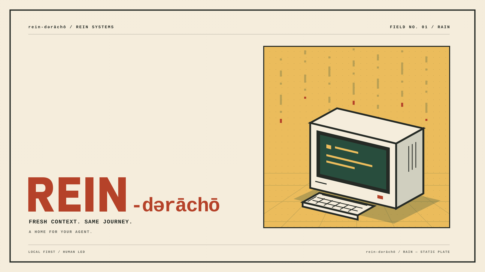
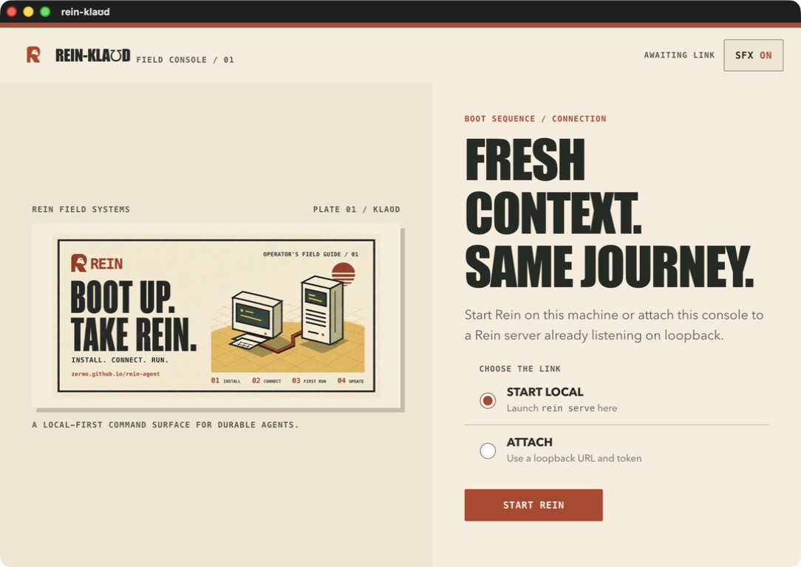
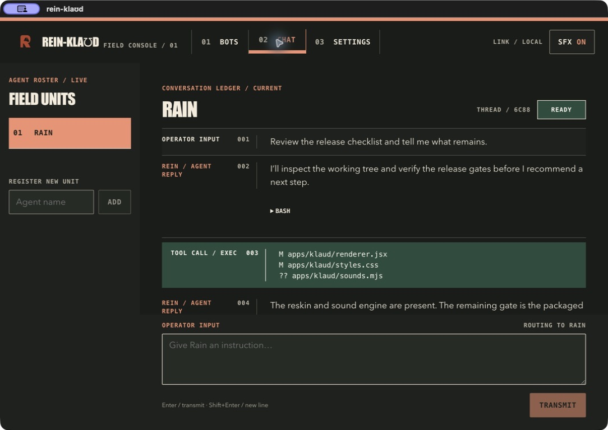
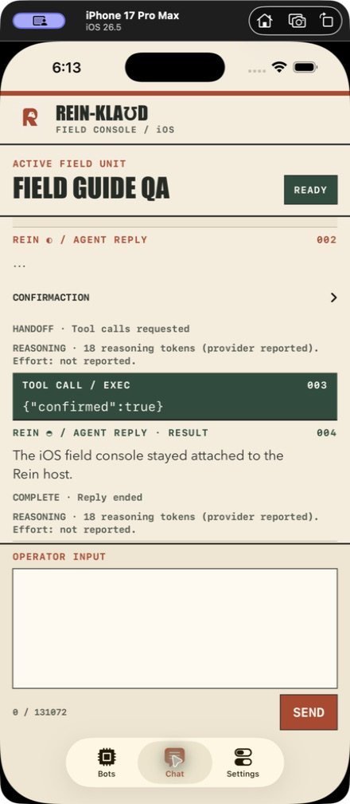

# Rein identity and repo cards

The artwork matches the installation field guide's cream paper, rust mark,
charcoal type, mustard grid, and retro computer illustration. The R contains
a horse-profile cutout. The small SVG mark is also embedded in the guide header
and favicon. Dareecho and rein-klaʊd use the same system: Dareecho frames its
rain around a readable terminal, while the apps use the field-manual controls
and hard rules for real chat and approval state.

| Asset | Format | Use |
| --- | --- | --- |
| [Repository card](assets/rein-repo-card.jpg) | 1280 x 640 JPEG | GitHub social preview and repository sharing |
| [Field guide card](assets/rein-field-guide-card.jpg) | 1280 x 640 JPEG | Sharing the public installation guide |
| [Repository card PNG](assets/rein-repo-card.png) | 1280 x 640 PNG | Lossless export |
| [Field guide card PNG](assets/rein-field-guide-card.png) | 1280 x 640 PNG | Lossless export |
| [Harness logo](assets/rein-logo.png) | 1024 x 1024 PNG | Square icon on cream |
| [Scalable logo](assets/rein-logo.svg) | SVG | Transparent single-color mark |
| [Browser icon](assets/rein-icon.svg) | SVG | Small square icon on cream |

The cards use the supplied 1280 x 640 GitHub template's proportions, with the
important content inside an 80-pixel inset. Template text and guides are absent
from the finished exports. JPEG exports are below GitHub's 1 MB upload limit.
The PNG logo has a cream background; use the SVG for transparency.

The [public field guide](https://zermo.github.io/rein-agent/) uses the field-guide
card in its Open Graph metadata. The [wiki](https://github.com/Zermo/rein-agent/wiki)
links to the guide. Instructions for publishing changes are in
[guide-deployment.md](guide-deployment.md).

## Artwork source

The card illustrations and initial R mark were made with the built-in image
generation tool, using the supplied GitHub template and the existing field-guide
cover as references. The SVG mark is a hand-authored geometric version for crisp
small display. PNG and JPEG exports were sized for delivery without changing the
artwork's aspect ratio. The final prompts are recorded in
[branding-prompts.md](branding-prompts.md).

Palette: cream `#f5eddc`, charcoal `#252a25`, rust `#b54229`, mustard `#ebbc5c`,
and green `#284d3d`. Keep the mark clear of nearby text and preserve the horse
counter. At small sizes, use the simple mark rather than a full card.

## Product previews

These are checked-in product assets and QA captures, not concept art. They are
the canonical repository previews for the OS kit and the rein-klaʊd interfaces;
the linked source files retain their original resolution.

| Surface | Preview | What it establishes |
| --- | --- | --- |
| Dareecho rain plate |  | The OS kit shares the cream, rust, amber, green, and ink palette; rain stays in the frame rather than masquerading as task activity. |
| rein-klaʊd desktop, light |  | The desktop keeps the field-guide card, hard rules, square controls, and R-horse mark. |
| rein-klaʊd desktop, night |  | Night mode reverses the reading contrast while preserving rust actions and terminal-green operational output. |
| rein-klaʊd iPhone |  | The mobile client carries the same hierarchy into a compact, resumable gateway surface. |

Do not use the QA captures as generic stock imagery or crop out the status and
approval context. Regenerate a capture after a material UI change, then update
this page and the relevant app QA notes together.
